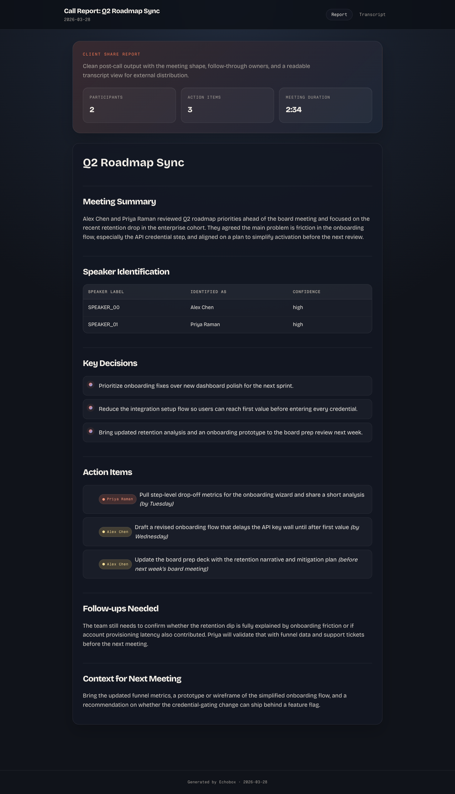

# Echobox

> **Alpha** — macOS only, for technical users comfortable with CLI tools and manual setup

Echobox is a self-hosted call intelligence pipeline for macOS. It records both sides of a call in parallel (system audio + your own mic), transcribes with Whisper, identifies enrolled speakers by voice fingerprint, enriches the transcript with a local MLX server and project context, and publishes a clean HTML report you can search later.

Core processing stays on your machine: transcription, diarization, voice identification, and enrichment run locally. Optional integrations such as web lookup, Claude-powered report generation, and Vercel publishing only make outbound requests when you enable them.



## What Happens When You Take a Call

1. **Call detected** — Echobox watches your browser tabs and meeting apps for Meet/Zoom/Teams URLs
2. **Dual-stream capture** — two parallel audio streams are recorded: BlackHole captures the remote side (other participants' audio), and your local mic (AirPods / USB / built-in, auto-selected from the macOS default input) captures your own voice. Requires BlackHole + Multi-Output Device in Audio MIDI Setup
3. **Call ends** — the built-in watcher stops recording and triggers the pipeline
4. **Tracks mixed** — ffmpeg `amix` combines remote + local tracks into `<slug>.wav`, with the raw tracks kept alongside as `<slug>-remote.wav` / `<slug>-local.wav`
5. **Transcribed** — mlx-whisper transcribes the mixed WAV locally with MLX/Metal on Apple Silicon
6. **Speakers diarized + identified** — pyannote.audio segments speakers, then wespeaker-voxceleb-resnet34-LM compares each segment against your enrolled voices (`./echobox enroll-voice ...`) and replaces SPEAKER_XX labels with real names when cosine similarity ≥ 0.55
7. **Calendar matched** — the transcript timestamp is matched to your calendar event, pulling attendee names
8. **Context curated** — based on meeting type, relevant docs/messages/web context is gathered
9. **LLM enrichment** — everything is sent to your local MLX model: transcript + attendees + context. It produces a structured analysis with decisions, action items with owners and deadlines, and follow-ups
10. **Slug derived** — a meaningful slug (e.g. `galaxydigital-meeting-2026-04-14`) is pulled from the enrichment output and renames the artifacts
11. **JSON sidecar** — structured data is extracted into a JSON file for integrations
12. **HTML report** — a styled dark-themed report is generated with stat cards, speaker tables, and colored owner tags
13. **Published** — report saved locally (or deployed to password-gated Vercel)
14. **Meeting notes sync** — when configured, the enrichment + transcript + report are rsync'd to a remote `meeting_notes` workspace
15. **Notification** — optional webhook fires with the report URL and meeting summary. Delivery attempts are audited to `~/echobox-data/logs/notifications.log`

After setup, the watcher and pipeline can run automatically from call end through report publish. End-to-end time depends heavily on your model choice and hardware. The menu bar icon shows recording status, and an "End Call" button lets you manually trigger processing without waiting for tab detection.

Audio is streamed directly to disk during recording, so long calls don't accumulate memory pressure. The watcher recovers from transient errors without restarting, and enrichment input is capped to prevent OOM on very long transcripts.

**Expect fan noise during processing.** Transcription and LLM enrichment run entirely on-device using MLX/Metal, which pushes your Apple Silicon hard. The fans spinning up after a call ends is normal — it means your data is being processed locally and privately, never leaving your machine. This is the trade-off for full local processing: your hardware does the work that a cloud service would otherwise handle.

After the call: `echobox list` to browse, `echobox open` to view the report, `echobox search "topic"` to find past discussions, `echobox actions` to see all outstanding action items across calls.

## Why Use It

- Record and process calls without sending raw transcripts to a SaaS by default
- Match recordings to calendar events and attendees for better speaker labeling
- Pull in context from documents, messages, and the web when useful
- Publish a readable HTML report and keep transcripts searchable over time
- Run on one machine or split recording and enrichment across two machines

## Status

| Area | macOS |
|------|:-----:|
| Dual-stream recording (BlackHole + local mic) | Supported |
| Transcription | Supported |
| Speaker diarization | Supported |
| Voice fingerprint identification (enrolled speakers) | Supported |
| Optional Swift capture helper (WhisperKit live captions) | Opt-in |
| Local MLX enrichment | Supported |
| Calendar, docs, messages context | Supported with config |
| Local HTML publishing | Supported |
| Vercel publishing | Supported |
| Auto call detection | Built in |
| Tiered audio retention / auto-cleanup | Supported with config |

## Setup

> Requires: macOS (Apple Silicon), Homebrew, Python 3.12+, ffmpeg, SwitchAudioSource (for BlackHole routing), BlackHole 2ch + Multi-Output Device, a Hugging Face token, and a local MLX model/server.

```bash
git clone https://github.com/marczeller/echobox.git && cd echobox
./install.sh
```

1. Run `./install.sh`; on fresh installs it creates `config/echobox.yaml` and runs hardware fit
2. Install BlackHole 2ch and create a Multi-Output Device (Audio MIDI Setup → **+** → Create Multi-Output Device → check **AirPods/headphones** AND **BlackHole 2ch**) → set it as the system Output
3. Copy `.env.example` to `.env` and fill in `HF_TOKEN` — get a "Read" token at https://huggingface.co/settings/tokens. **Accept the license** for [pyannote/speaker-diarization-3.1](https://huggingface.co/pyannote/speaker-diarization-3.1) and [pyannote/wespeaker-voxceleb-resnet34-LM](https://huggingface.co/pyannote/wespeaker-voxceleb-resnet34-LM) on Hugging Face while logged in
4. Run `./echobox status` to see what is still missing
5. Optionally run `./echobox smart-setup` to probe the machine and draft context-source recommendations
6. Review and edit `config/echobox.yaml`
7. Start your MLX model server
8. Run `./echobox demo` to verify prompt and report generation
9. **First run**: launch `./echobox watch` from **Terminal.app** (not over SSH) so macOS can surface the Microphone TCC permission dialog. Click **Allow**. Only then install the launchd plist — launchd-managed processes can't trigger the TCC prompt themselves

### Enroll your voice (optional but recommended)

Voice identification replaces `SPEAKER_XX` labels with real names when the cosine similarity of a diarized segment against an enrolled reference ≥ 0.55.

```bash
# Record 30-60s of clean speech from just you, then enroll:
./echobox enroll-voice marc /path/to/marc-reference.wav "Marc Zeller"
```

Or use the **Voices → Enroll new voice...** item in the menu bar, which opens a file picker. Enrolled voices live in `voices/<slug>.{npy,json}` (gitignored — biometric data).

See a [sample report](docs/sample-report.html) generated from the demo fixtures.

## How It Works

| Stage | What Happens |
|-------|-------------|
| **1. Detection** | A watcher detects that a call has started or ended |
| **2. Recording** | Microphone audio is streamed to a WAV file on disk |
| **3. Transcription** | mlx-whisper transcribes the call locally with MLX/Metal |
| **4. Diarization** | pyannote.audio segments speakers |
| **5. Enrichment** | A local LLM receives the transcript plus project context |
| **6. Publishing** | A styled HTML report is generated locally or deployed |
| **7. Notification** | An optional webhook posts the finished report URL |

## Data Directory Layout

```
~/echobox-data/
  transcripts/   # .txt transcripts (one per call)
  audio/         # <slug>.wav, <slug>-local.wav, <slug>-remote.wav
  enrichments/   # <slug>-enriched.md + sidecar .json
  reports/       # <slug>-enriched/report.html
  logs/          # watcher.log, pipeline.log, notifications.log
```

Audio is split from transcripts so retention and disk management only touch the large files. Tiered cleanup: set `cleanup.raw_track_retention_days` (default 7) to age out dual-track artifacts, and `cleanup.mixed_audio_retention_days` (default 0 = keep forever) for the final mix. The menu bar runs the sweep every `cleanup.sweep_interval_minutes` (default 60), or trigger it manually via **Disk → Prune old audio now**.

## Common Commands

| Command | Purpose |
|---------|---------|
| `echobox watch` | Run the watcher and process calls automatically on macOS |
| `echobox list` | Show recent calls and reports |
| `echobox open [report]` | Open the latest report or a named report |
| `echobox preview [call-or-file]` | Preview enrichment markdown in the terminal |
| `echobox search <term>` | Search transcripts and enrichments |
| `echobox actions` | Show action items across enriched calls |
| `echobox summary` | Show a weekly cross-call summary |
| `echobox enroll-voice <slug> <wav> <name>` | Enroll a reference voice for speaker identification |
| `echobox voices [list\|delete <slug>]` | Manage enrolled voices (defaults to list) |
| `echobox enrich <file>` | Run LLM enrichment on a transcript |
| `echobox publish <file>` | Generate HTML report from enrichment |
| `echobox reprocess <name>` | Re-run enrichment and publishing for a call |
| `echobox serve [--tunnel X]` | Serve reports with password gate (local/tailscale/bore) |
| `echobox smart-setup [--with-calendar]` | Probe the machine and draft setup recommendations |
| `echobox status` | Check whether the pipeline is configured correctly |
| `echobox config` | Show parsed config values |
| `echobox quality` | Run pipeline and context quality checks |
| `echobox fit` | Benchmark your hardware and recommend models |
| `echobox demo` | Run the pipeline walkthrough on sample data |
| `echobox test` | Run smoke tests |
| `echobox clean [--older N] [--prune] [--audio]` | Show disk usage and optionally delete old data (include `.wav` with `--audio`) |
| `echobox version` | Print version |

## Configuration

Main config lives in `config/echobox.yaml`. `./install.sh` creates it automatically if it does not exist.

Configured paths support `~` and environment-variable expansion.

Important settings:

- `whisper_model`, `mlx_model`, `mlx_url`: transcription model, enrichment model, and local MLX endpoint
- `context_sources`: calendar, messages, documents, and web integrations
- `team.members`, `team.internal_domains`, `team.roles`: speaker identity hints
- `meeting_types`: rules for classifying calls and choosing context
- `publish.engine`: `local` or `claude` HTML generation
- `publish.platform`, `publish.password`, `publish.scope`: local or Vercel publishing settings

For configuration examples, see [config/echobox.example.yaml](config/echobox.example.yaml) and [docs/context-sources.md](docs/context-sources.md).

## Diagnose Problems Quickly

Start with:

```bash
./echobox status
./echobox config
./echobox demo
```

Logs live in `~/echobox-data/logs/`.

For recording issues, built-in recorder troubleshooting, and model-server problems, see [docs/troubleshooting.md](docs/troubleshooting.md).

## Where To Go Next

- Setup and install steps: [docs/setup.md](docs/setup.md)
- Context source configuration: [docs/context-sources.md](docs/context-sources.md)
- Troubleshooting: [docs/troubleshooting.md](docs/troubleshooting.md)
- Architecture rationale: [docs/design-decisions.md](docs/design-decisions.md)

## License

MIT. See [LICENSE](LICENSE).
